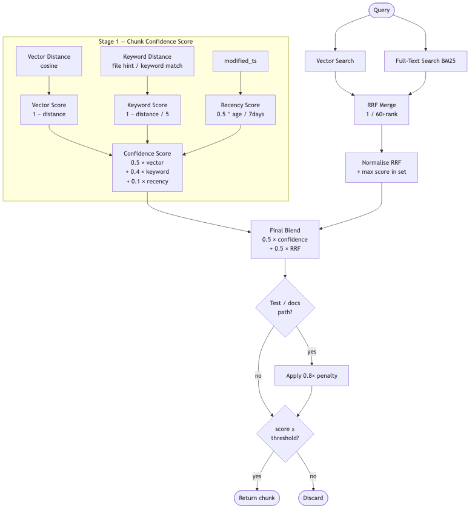
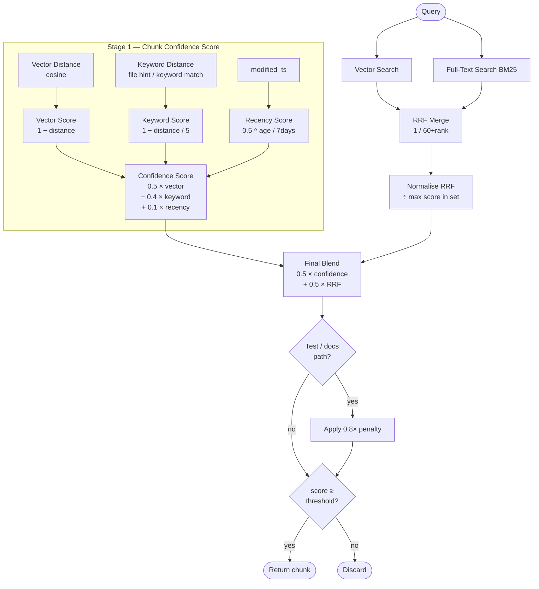

# Confidence Scoring

Every chunk returned by CCE has a `confidence_score` between 0 and 1. This page explains how that score is computed and how to use the `confidence_threshold` config to filter results.

---

## Overview

Scoring happens in two stages:

1. **Chunk-level confidence score** — measures how well a chunk matches the query on its own (vector similarity, keyword overlap, recency).
2. **Final blend** — combines the chunk confidence score with a normalised RRF rank (which captures how the chunk performed across both vector and full-text search).

---

## Algorithm Flowchart





---

## Stage 1 — Chunk Confidence Score

Defined in `src/context_engine/retrieval/confidence.py`.

### Inputs

| Input | Type | Source |
|---|---|---|
| `vector_distance` | float [0, 2] | Cosine distance from query embedding to chunk embedding |
| `keyword_distance` | int [0, 5] | Estimated token distance between query keywords and chunk content |
| `modified_ts` | float (Unix timestamp) | From chunk metadata; `None` if unavailable |

### Formula

```
confidence_score = 0.5 × vector_score
                 + 0.4 × keyword_score
                 + 0.1 × recency_score
```

Each component is normalised to [0, 1] before weighting.

> **Note:** The README currently states weights of 50/30/20. The implementation uses **50/40/10**. The code is authoritative.

### Component breakdown

**Vector score**

```
vector_score = max(0, 1 - vector_distance)
```

Cosine distance from sqlite-vec is in [0, 2]. A distance of 0 (identical vectors) yields a score of 1.0; a distance of 1 (orthogonal) yields 0.0.

Before being passed to `ConfidenceScorer`, the raw distance is normalised to [0, 1] by the retriever:

```python
normalised_distance = min(max(distance / 2.0, 0.0), 1.0)
```

**Keyword score**

```
keyword_score = max(0, 1 - (keyword_distance / 5))
```

`keyword_distance` is estimated by `HybridRetriever._estimate_keyword_distance`:

- `0` — the query's file hint appears in the chunk's file path, **or** any parsed keyword appears in the chunk content.
- `2` — neither condition is met (default miss).

So in practice, keyword_score is either `1.0` (direct hit) or `0.6` (no match), not a continuous gradient. The `_MAX_KEYWORD_DISTANCE = 5` cap exists to allow for future finer-grained distance values.

**Recency score**

```
recency_score = 0.5 ^ (age_seconds / half_life)
```

where `half_life = 604800` seconds (7 days).

| Age | Score |
|---|---|
| Just modified | ~1.0 |
| 7 days old | 0.50 |
| 14 days old | 0.25 |
| 30 days old | ~0.05 |
| No `modified_ts` | 0.50 (neutral default) |

Recency only contributes 10% of the total score, so it nudges ranking rather than dominating it.

---

## Stage 2 — Final Score Blend

Defined in `src/context_engine/retrieval/retriever.py`.

After scoring all candidates, the retriever blends chunk confidence with normalised RRF rank:

```
final_score = 0.5 × confidence_score + 0.5 × normalised_rrf
```

**RRF score** is computed from vector rank and FTS rank:

```
rrf_score = 1 / (60 + vector_rank) + fts_weight × 1 / (60 + fts_rank)
```

`fts_weight = 1.5` when the query is parsed as a `CODE_LOOKUP` intent (exact identifier search); otherwise `1.0`. This boosts exact-name matches when the user is clearly looking for a specific symbol.

RRF scores are then normalised by the best score in the candidate set before blending, so rank gradient is preserved rather than saturating near 1.0.

### Path penalty

After blending, chunks from deprioritised paths receive a 0.8× score penalty:

```
Penalised paths: tests/, test_, docs/, spec, plan
```

Git-remote paths (prefixed `git:`) are exempt from the penalty.

### Result ordering

Chunks are sorted by `final_score` descending. A file diversity cap (`_MAX_CHUNKS_PER_FILE = 3`) then limits how many chunks from the same file can appear in the top-k results, so a single large file doesn't crowd out others.

---

## `confidence_threshold` Config

Only chunks with `final_score >= confidence_threshold` are returned.

**Default:** `0.2`

Configure in `cce.toml`:

```toml
[retrieval]
confidence_threshold = 0.2
```

Or pass it per-query via the MCP tool:

```json
{ "query": "...", "confidence_threshold": 0.4 }
```

### Choosing a threshold

| Threshold | Behaviour |
|---|---|
| `0.0` | Return everything; useful for debugging what's in the index |
| `0.2` (default) | Light filtering; good for exploratory queries |
| `0.4–0.6` | Tighter filtering; fewer results but higher precision |
| `> 0.7` | Very strict; only near-exact matches returned |

If you're getting too many irrelevant chunks, raise the threshold. If queries return nothing, lower it or check that the index is up to date.

---

## End-to-End Example

Query: `"validate user token"`

| Chunk | Vector dist | Keyword hit | Age | Conf score | RRF (norm) | Final score |
|---|---|---|---|---|---|---|
| `auth.py:validate_token` | 0.10 → score 0.95 | yes → 1.0 | 2 days → 0.82 | **0.90** | 1.00 | **0.95** |
| `middleware.py:check_auth` | 0.30 → score 0.85 | yes → 1.0 | 14 days → 0.25 | **0.77** | 0.72 | **0.75** |
| `tests/test_auth.py:test_token` | 0.25 → score 0.88 | yes → 1.0 | 1 day → 0.91 | **0.84** | 0.65 | **0.67 × 0.8 = 0.54** |

`test_auth.py` takes the path penalty (0.8×) and drops behind `middleware.py` despite a higher raw confidence score.

---

## See Also

- [How It Works](How-It-Works.md) — full pipeline overview including retrieval and graph expansion
- [Configuration](Configuration.md) — all `cce.toml` settings
- `src/context_engine/retrieval/confidence.py` — scorer implementation
- `src/context_engine/retrieval/retriever.py` — final blend and RRF logic
